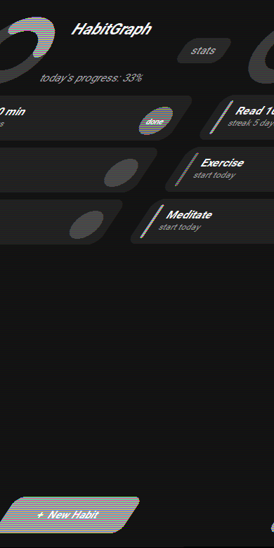
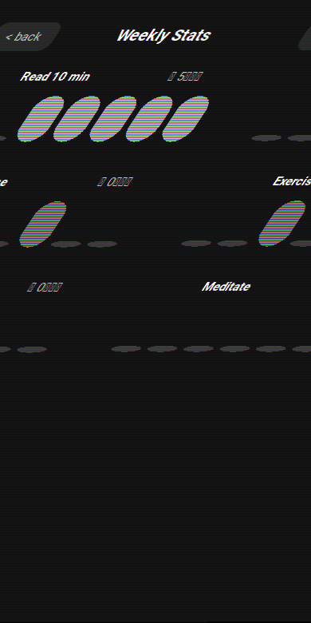
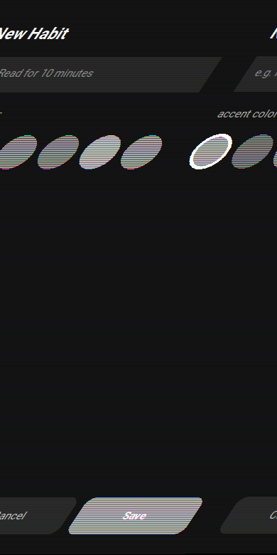

# 📊 HabitGraph

シンプルな**習慣トラッカー**のスマホアプリです。[Kivy](https://kivy.org/) (Python製のクロスプラットフォームGUIフレームワーク) だけで書かれていて、Android / iOS 両対応の実機アプリとしてビルドできます。

外部のグラフライブラリは使わず、達成率のリング表示も週間バーチャートも **Kivyのcanvas命令で自前描画** しています。

<p align="center">
  
  
  
</p>

## ✨ 機能

- 習慣の登録(名前 + アクセントカラー)
- ワンタップで今日の達成/未達成をトグル
- 連続達成日数(ストリーク)の自動計算
- 直近7日間の達成状況を習慣ごとにバーチャートで表示
- 今日全体の達成率をリング状のプログレスで表示
- データはJSONでローカル保存、サーバー不要・完全オフライン動作

## 🗂️ プロジェクト構成

```
habitgraph/
├── main.py                  # エントリーポイント(App/ScreenManager初期化)
├── habitgraph.kv             # 全画面の見た目定義(Kv言語)
├── data/
│   └── storage.py           # Kivy非依存のデータ層(JSON永続化・ストリーク計算)
├── widgets/
│   ├── habit_card.py         # 習慣1件ぶんの行ウィジェット
│   ├── bar_chart.py          # 週間バーチャート(自前canvas描画)
│   └── ring_progress.py      # 達成率リング(自前canvas描画)
├── screens/
│   ├── home_screen.py        # ホーム画面
│   ├── add_habit_screen.py   # 習慣追加画面
│   └── stats_screen.py       # 統計画面
├── tests/
│   └── test_storage.py       # データ層のpytestユニットテスト
├── buildozer.spec            # Android/iOSビルド設定
└── .github/workflows/        # CI: テスト自動実行 + APK自動ビルド
```

データ層(`data/storage.py`)はKivyに一切依存しない純粋なPythonで書いてあります。GUIを起動せずに `pytest` だけで高速にテストできるようにするためです。

## 🚀 デスクトップで動かす

開発中の動作確認はPCから行えます。

```bash
pip install kivy
python main.py
```

## 📱 スマホアプリとしてビルドする(Android)

[Buildozer](https://buildozer.readthedocs.io/) を使うと、このPythonコードがそのまま `.apk` になります。

```bash
pip install buildozer
buildozer android debug
```

初回はAndroid SDK/NDKの自動ダウンロードが走るため、Linux環境かWSLでの実行を推奨します。ビルドが終わると `bin/` ディレクトリに `.apk` が生成されるので、スマホに転送してインストールできます。

GitHubにpushすると `.github/workflows/build.yml` が自動的にAPKをビルドし、Actionsのartifactとしてダウンロードできるようにもなっています。

## 🌐 紹介ページ(GitHub Pages)

`index.html` は GitHub Pages 用の紹介ランディングページです。アプリ本体(Kivy)はブラウザ上では動かないので、これは「アプリを紹介してAPKを配布する」ための静的ページという位置づけです。

有効化手順:
1. GitHubリポジトリの `Settings` → `Pages`
2. `Source` を `Deploy from a branch` に設定
3. `Branch` を `main` / `/ (root)` に設定して `Save`
4. 数分後、`https://your-username.github.io/habitgraph/` でページが公開される

`index.html` 内の `your-username` になっている部分(GitHubリンク)は自分のユーザー名に置き換えてください。

## ✅ テスト

```bash
pip install pytest
pytest tests/ -v
```

## 🛠️ 今後の拡張アイデア

- リマインダー通知(`plyer` でOS通知)
- 月間カレンダービュー
- 習慣の並び替え・アーカイブ
- ダークモード/ライトモード切り替え

## License

MIT
